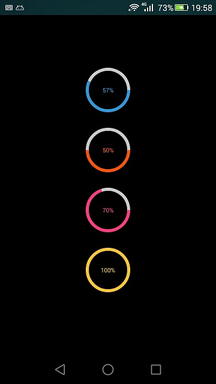

##Android RoundProgressBar 

-----

一个仿[代码家的数字进度条](https://github.com/daimajia/NumberProgressBar)写的圆形进度条控件

---
IDE:Eclipse    
    
使用方法：    

```java
	<com.miao.roundprogressbar.RoundProgressBar
        android:id="@+id/roundbar1"
        style="@style/RoundProgressBar_Default"
        android:layout_marginTop="100dp"
        android:layout_width="100dp"
        android:layout_height="100dp"
        android:layout_gravity="center"
        custom:progress_current="0" />
```	

效果图：     
        
      

